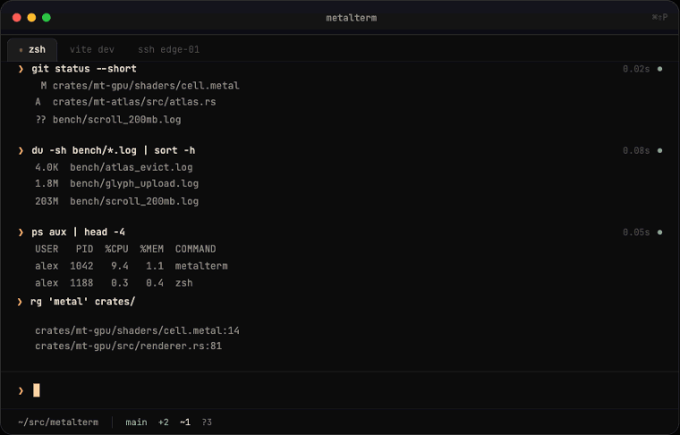

# Metalterm

The landing page for [Metalterm](https://metalterm.dev) — a GPU-rendered macOS terminal built on Metal 3.



## What's here

A single static page (`index.html`, no build step) served by GitHub Pages at
[metalterm.dev](https://metalterm.dev), plus the icons and manifest in `assets/`.

## Local preview

```
python3 -m http.server 8000
```

then open `http://localhost:8000`.

## Deployment

GitHub Pages, source = `main` branch, root. The custom domain is set via `CNAME`
(`metalterm.dev`), with Cloudflare DNS pointed at GitHub Pages' IPs.

## Releases

The `.dmg` is hosted on the [`downloads`](https://github.com/pioner92/metalterm-site/releases/tag/downloads)
release — a permanent, single tag that assets accumulate under, since the app's
Sparkle appcast (`https://metalterm.dev/appcast.xml`) needs one stable download
URL prefix for the whole update feed. Version history lives in the appcast, not
in GitHub releases.

## Support

support@metalterm.dev
